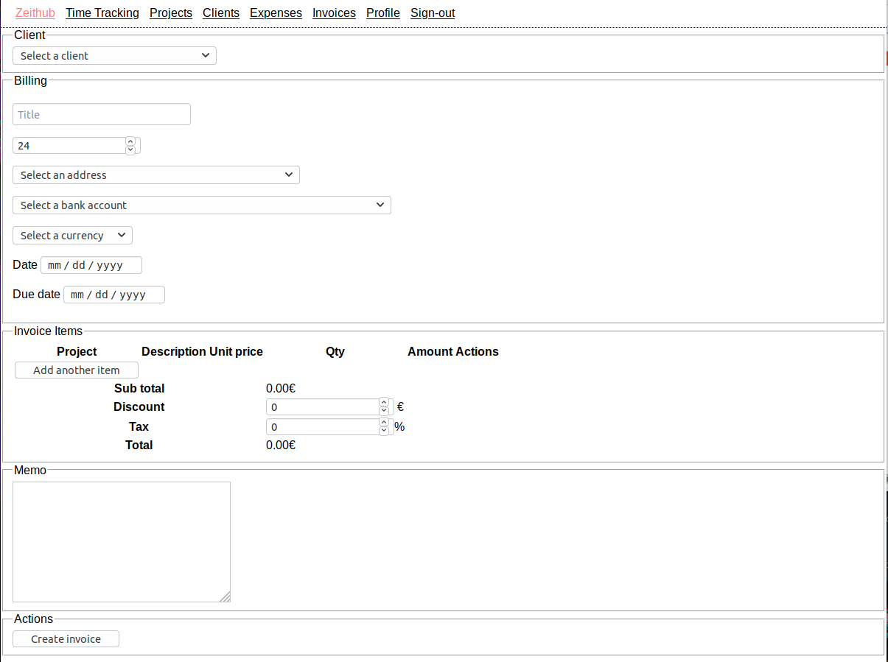

# Zeithub



## Introduction

Zeithub is an open source time tracking, invoicing & expenses management for freelancers.

## Installation

```bash
cp example.env .env
docker-compose up -d
npm install
npm run db:up
```

To run locally:

`npm run dev`

The app is now available at http://localhost:3000

## How to create a new migration

```bash
npx db-migrate create --config config/database.json my-fancy-migration --sql-file
```

## Prod installation with Docker

As prerequesites, you will need docker and docker-compose.

```
mkdir ~/zeithub
cd ~/zeithub
wget -O docker-compose.yml https://raw.githubusercontent.com/m0g/zeithub/master/docker-compose.prod.yml 
docker-compose up -d
```

then we need to populate the database:

```
docker-compose exec zeithub npm run db:up
```

## Backup & Restore MySQL database

### Backup

```
docker exec CONTAINER /usr/bin/mysqldump -u root --password=root DATABASE > backup.sql
```

### Restore

```
cat backup.sql | docker exec -i CONTAINER /usr/bin/mysql -u root --password=root DATABASE
```