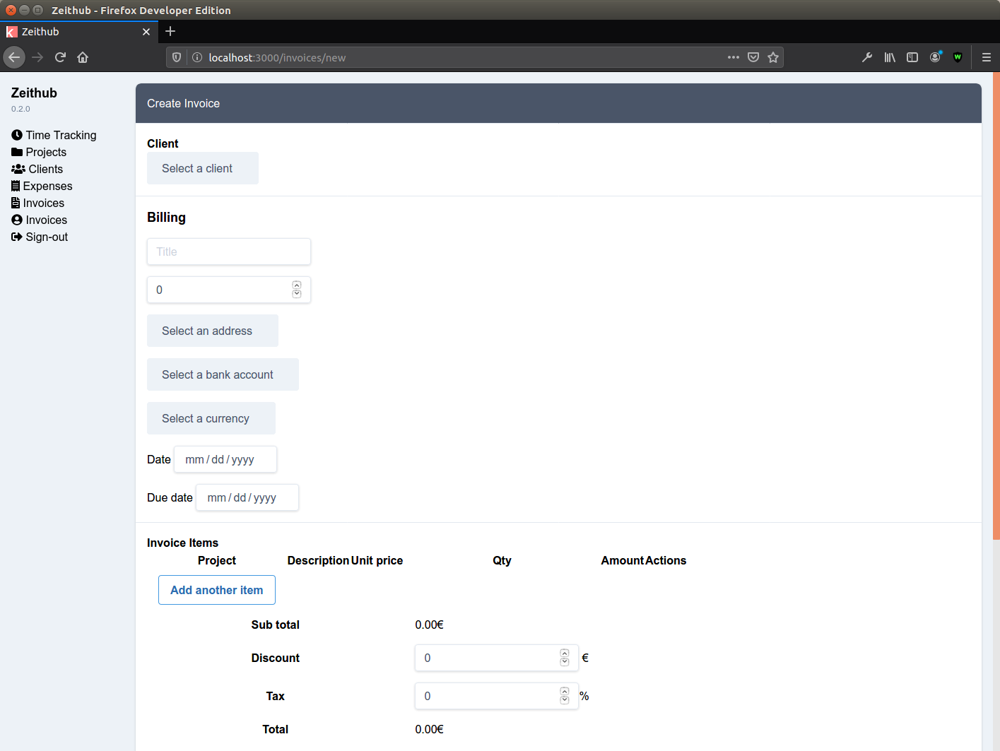

# Zeithub



## Introduction

Zeithub is an open source time tracking, invoicing & expenses management for freelancers.

## Installation

```bash
cp example.env .env
docker-compose up -d
npm install
npm run db:up
```

To run locally:

`npm run dev`

The app is now available at http://localhost:3000

## How to create a new migration

```bash
npx db-migrate create --config config/database.json my-fancy-migration --sql-file
```

## Prod installation with Docker

As prerequesites, you will need docker and docker-compose.

```
mkdir ~/zeithub
cd ~/zeithub
wget https://raw.githubusercontent.com/m0g/zeithub/master/docker-compose.prod.yml docker-compose.yml
docker-compose up -d
```
